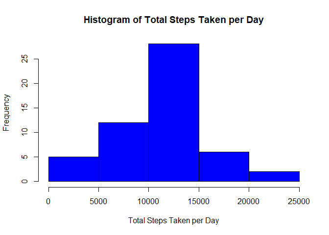
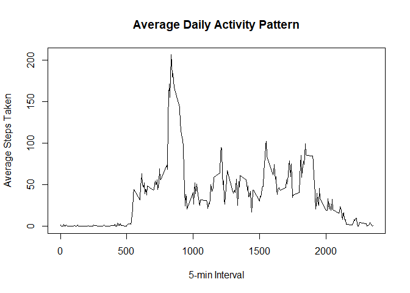
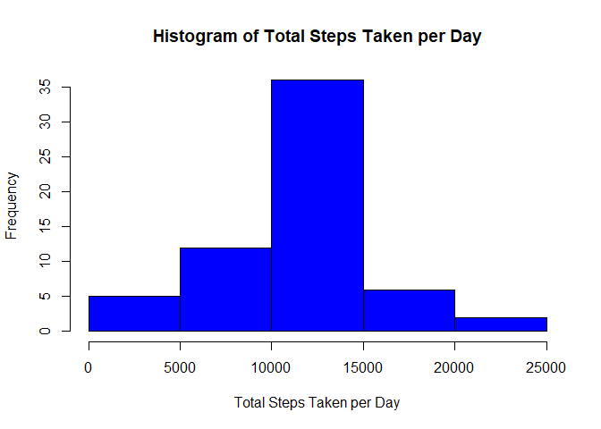
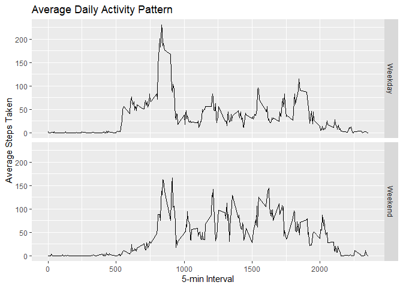

## Set global options

To ensure that the the code is always echoed, we will set the global options.


```r
library(knitr)
opts_chunk$set(echo = TRUE)
```

## Loading and preprocessing the data

The data is stored in the repository, named *activity.zip*.  
We have to unzip it to obtain the dataset *activity.csv*.


```r
unzip("activity.zip")
data <- read.csv("activity.csv", header = TRUE, na.strings = "NA")
str(data)
```

```
## 'data.frame':	17568 obs. of  3 variables:
##  $ steps   : int  NA NA NA NA NA NA NA NA NA NA ...
##  $ date    : Factor w/ 61 levels "2012-10-01","2012-10-02",..: 1 1 1 1 1 1 1 1 1 1 ...
##  $ interval: int  0 5 10 15 20 25 30 35 40 45 ...
```

As shown above, there are 3 variables and 17568 observations in this dataset:  

* **steps**: Number of steps taking in a 5-minute interval (missing values are coded as `NA`)
* **date**: The date on which the measurement was taken in YYYY-MM-DD format
* **interval**: Identifier for the 5-minute interval in which measurement was taken

In order to accurately reflect the date, we need to change its format.


```r
data$date <- as.Date(data$date,format="%Y-%m-%d")
str(data)
```

```
## 'data.frame':	17568 obs. of  3 variables:
##  $ steps   : int  NA NA NA NA NA NA NA NA NA NA ...
##  $ date    : Date, format: "2012-10-01" "2012-10-01" ...
##  $ interval: int  0 5 10 15 20 25 30 35 40 45 ...
```

## What is mean total number of steps taken per day?

In order to answer the question, we have to calculate the total number of steps taken each day first,
given that we ignore the missing values:


```r
steps_per_day <- aggregate(steps ~ date, data, sum, na.rm = TRUE)
```

We can make a histogram of the total number of steps taken each day to see the general trend:

```r
hist(steps_per_day$steps,
     main = "Histogram of Total Steps Taken per Day", xlab = "Total Steps Taken per Day", col = "blue")
```

<!-- -->

Then, we will calculate the mean and median of total number of steps taken per day.


```r
paste("The mean total steps taken per day is", round(mean(steps_per_day$steps),2))
```

```
## [1] "The mean total steps taken per day is 10766.19"
```

```r
paste("The median total steps taken per day is", median(steps_per_day$steps))
```

```
## [1] "The median total steps taken per day is 10765"
```

## What is the average daily activity pattern?

In order to answer the question, we will produce a time-series plot,
with x-axis as the 5-minute interval (*interval*) and y-axis as average steps taken per day averaged across all days.

First, we wll calculate the average steps taken for each 5-min interval:

```r
mean_steps <- aggregate(steps ~ interval, data, mean)
```

Then, we can generate the plot:

```r
with(mean_steps, plot(x = interval, y = steps, type = "l",
     main = "Average Daily Activity Pattern", xlab= "5-min Interval", ylab= "Average Steps Taken"))
```

<!-- -->

Besides, we can also examine the 5-minute interval which has the maximum number of steps:

```r
mean_steps[which.max(mean_steps$steps),1]
```

```
## [1] 835
```

## Imputing missing values

Note that there are a number of days/intervals where there are missing values (coded as `NA`). 
The presence of missing days may introduce bias into some calculations or summaries of the data.

First, we need to know how many missing values in the dataset (i.e. the total number of rows with `NA`s)

```r
nrow(data[is.na(data),])
```

```
## [1] 2304
```

In this case, we will fill in the missing values by using the **mean steps taken for the particular 5-min interval**.

Specifically, we create a new dataset called *data2*, then we create a loop to:

* Check whether the *steps* is `NA` in *data2*
* If so, then we will replace the `NA` with the mean steps taken from `mean_steps` calculated earlier
* We will use the *interval* from both datasets as the matching reference


```r
data2 <- data

for (i in 1:nrow(data2)) {
    if (is.na(data2[i,"steps"])) {
        data2[i,"steps"] <- mean_steps[match(data2[i,"interval"], mean_steps[,"interval"]), "steps"]
    }
}
```


Let's see whether there are any `NA` in the new dataset:

```r
sum(is.na(data2))
```

```
## [1] 0
```

Upon requested, we then make another histogram of the total number of steps taken each day:


```r
new_steps_day <- aggregate(steps ~ date, data2, sum)
hist(new_steps_day$steps,
     main = "Histogram of Total Steps Taken per Day", xlab = "Total Steps Taken per Day", col = "blue")
```

<!-- -->

Then, we will compute a new *mean* and *median* total steps taken per day using `data2`.

```r
paste("The mean total steps taken per day is", round(mean(new_steps_day$steps),2))
```

```
## [1] "The mean total steps taken per day is 10766.19"
```

```r
paste("The median total steps taken per day is", median(new_steps_day$steps))
```

```
## [1] "The median total steps taken per day is 10766.1886792453"
```

The new mean doesn't differ from the previous mean, which is expected because all the NA values are replaced with the
mean steps per interval. However, the new median has shifted from 10765 to 10766.19 due to the inclusion of the data,
though the changes of median is not signiicant considering the small shift after replacing 2304 missing values.

Hence, there is *little impact* of imputing missing data on the estimates of the total daily number of steps if we use
the method of replacing missing value with respective mean value per interval.

## Are there differences in activity patterns between weekdays and weekends?

In order to answer the question, we have to create a new factor indicating weekdays or weekends:

```r
data2 <- data.frame(data2, weekdays = NA)

for (i in 1:nrow(data2)){
    if(weekdays(data2[i,"date"]) %in% c("Saturday","Sunday")) {
        data2[i, "weekdays"] <- "Weekend"
    } else {
        data2[i, "weekdays"] <- "Weekday"
    }
}

data2$weekdays <- factor(data2$weekdays)
```

Then, we shall aggregate the data from `data2` to create time series plots of the
5-minute interval (x-axis) and the average number of steps taken, averaged across all weekday or weekend (y-axis).


```r
mean_steps2 <- aggregate(steps ~ interval + weekdays, data2, mean)

library(ggplot2)
with(mean_steps2, qplot(x=interval, y=steps, geom = "line", facets = weekdays~., 
                        main = "Average Daily Activity Pattern", xlab= "5-min Interval", ylab= "Average Steps Taken"))
```

<!-- -->
